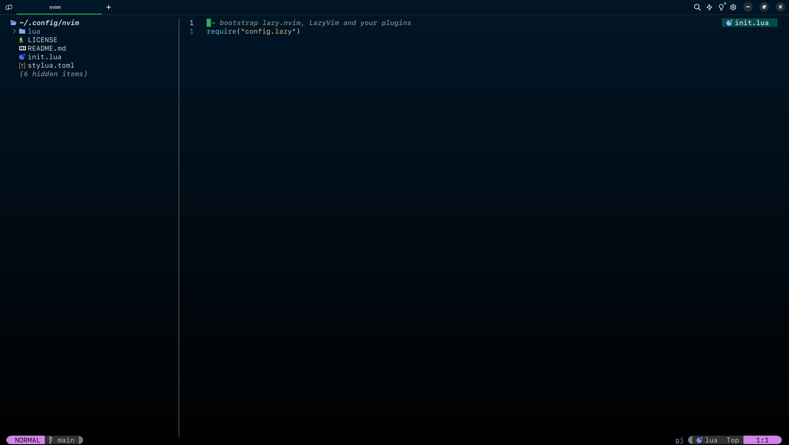

<h2 align="center">My Warp Theme</h2>



# Steps

## Linux

```bash
cd ${XDG_DATA_HOME:-$HOME/.local/share}/warp-terminal/themes
git clone BrauCamaH/warp-theme .
```

## Mac

```bash
cd ~/.warp/
git clone BrauCamaH/warp-theme .
```

# Set the theme

> go to Settings > Appearance > Themes

- ⚡️ Now select Space time as current theme.
